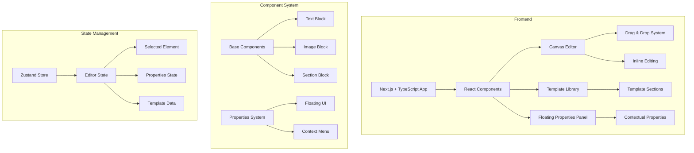

# Copyfolio Clone - Technical Implementation Plan

## System Architecture



## Key Components & Features

### 1. Core Application Structure
- Next.js 14 with App Router
- TypeScript for type safety
- Tailwind CSS + shadcn/ui for components
- Zustand for state management
- FloatingUI for contextual menus

### 2. Contextual Properties Panel
- Floating panel attached to selected elements
- Position-aware rendering using FloatingUI
- Component-specific property controls
- Smooth animations for panel appearance
- Click-away detection for dismissal

### 3. Canvas Components
- Section templates
- Text blocks with inline editing
- Image blocks with upload/replace
- Custom spacing controls
- Background settings

### 4. Properties System
- Typography controls (font, size, weight, etc.)
- Spacing controls (margin, padding)
- Color picker with preset palette
- Alignment controls
- Background settings
- Custom component-specific properties

### 5. Editor Features
- Direct inline text editing
- Real-time property updates
- Drag to reorder sections
- Copy/paste functionality
- Responsive preview modes

## Implementation Phases

### Phase 1: Foundation (2 weeks)
- Project setup with Next.js, TypeScript
- Component architecture setup
- State management implementation
- Basic canvas layout

### Phase 2: Component System (2 weeks)
- Base component implementation
- Text and image blocks
- Section containers
- Template structure

### Phase 3: Properties System (3 weeks)
- Floating UI implementation
- Property panel components
- Context-aware positioning
- Property controls development
- Real-time updates

### Phase 4: Template System (2 weeks)
- Template data structure
- Section loading system
- Template preview
- Drag and drop implementation

### Phase 5: Polish & Optimization (1 week)
- Animation refinement
- Performance optimization
- Browser testing
- Documentation

## Technical Specifications

```typescript
// Component Property Interface
interface ComponentProperties {
  id: string;
  type: 'text' | 'image' | 'section';
  position: {
    x: number;
    y: number;
  };
  style: {
    typography?: TypographyProps;
    spacing?: SpacingProps;
    background?: BackgroundProps;
  };
  content: any;
}

// Floating Property Panel
interface PropertyPanel {
  targetId: string;
  position: {
    anchor: 'left' | 'right';
    offset: {x: number, y: number};
  };
  properties: ComponentProperties;
}

// Template Section
interface TemplateSection {
  id: string;
  name: string;
  preview: string;
  components: ComponentProperties[];
  layout: {
    rows: number;
    columns: number;
    grid: string[][];
  };
}
```

## Key Dependencies
- @floating-ui/react for contextual menus
- @dnd-kit/core for drag and drop
- zustand for state management
- tailwindcss for styling
- shadcn/ui for base components
- react-contenteditable for inline editing
- @radix-ui/react-popover for property panels