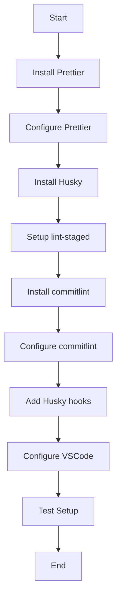

# Development Environment Setup Plan

## 1. Prettier Configuration

1. Add Prettier dependencies:

```bash
npm install --save-dev prettier prettier-plugin-tailwindcss
```

2. Create `.prettierrc.json` with the following configuration:

```json
{
  "semi": true,
  "singleQuote": true,
  "tabWidth": 2,
  "printWidth": 100,
  "trailingComma": "es5",
  "plugins": ["prettier-plugin-tailwindcss"]
}
```

3. Create `.prettierignore`:

```
dist
node_modules
coverage
build
```

4. Add Prettier script to package.json:

```json
{
  "scripts": {
    "format": "prettier --write \"src/**/*.{ts,tsx,css,md}\""
  }
}
```

## 2. Husky Setup

1. Install Husky and necessary dependencies:

```bash
npm install --save-dev husky lint-staged
```

2. Enable Git hooks:

```bash
npm pkg set scripts.prepare="husky"
git init
npm run prepare
```

3. Create lint-staged configuration in package.json:

```json
{
  "lint-staged": {
    "*.{ts,tsx}": ["eslint --fix", "prettier --write"],
    "*.{css,md,json}": ["prettier --write"]
  }
}
```

## 3. Commit Message Linting

1. Install commitlint:

```bash
npm install --save-dev @commitlint/cli @commitlint/config-conventional
```

2. Create commitlint configuration file `commitlint.config.js`:

```javascript
export default {
  extends: ['@commitlint/config-conventional'],
  rules: {
    'type-enum': [
      2,
      'always',
      [
        'feat',
        'fix',
        'docs',
        'chore',
        'style',
        'refactor',
        'ci',
        'test',
        'perf',
        'revert',
        'build',
      ],
    ],
  },
};
```

3. Add commitlint hook:

```bash
npx husky add .husky/commit-msg "npx --no -- commitlint --edit ${1}"
```

4. Add pre-commit hook:

```bash
npx husky add .husky/pre-commit "npx lint-staged"
```

## 4. VSCode Recommended Extensions

1. Create `.vscode/extensions.json`:

```json
{
  "recommendations": [
    "dbaeumer.vscode-eslint",
    "esbenp.prettier-vscode",
    "bradlc.vscode-tailwindcss",
    "formulahendry.auto-rename-tag",
    "christian-kohler.path-intellisense",
    "usernamehw.errorlens",
    "ms-vscode.vscode-typescript-next"
  ]
}
```

2. Create `.vscode/settings.json`:

```json
{
  "editor.defaultFormatter": "esbenp.prettier-vscode",
  "editor.formatOnSave": true,
  "editor.codeActionsOnSave": {
    "source.fixAll.eslint": "explicit"
  },
  "typescript.preferences.importModuleSpecifier": "shortest",
  "files.eol": "\n",
  "files.trimTrailingWhitespace": true,
  "files.insertFinalNewLine": true
}
```

## Implementation Flow



## Testing the Setup

After implementation, verify the setup by:

1. Running `npm run format` to test Prettier
2. Making a commit to test Husky hooks and commitlint
3. Opening VSCode to verify extension recommendations

Note: If you're adding Husky to an existing project that already has a .git directory, you can skip the `git init` step in the Husky setup.
