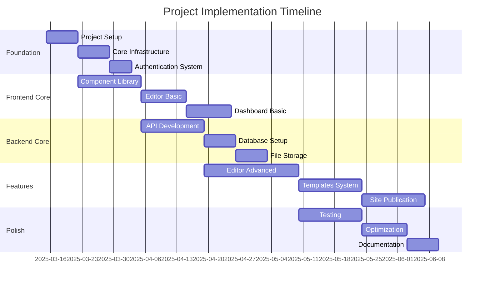

# Implementation Plan: Author Website Builder Platform

## Overview



## Phase 1: Foundation (Weeks 1-2)

### Week 1: Project Setup
1. **Repository Setup**
   ```bash
   # Initialize monorepo
   pnpm init
   pnpm add -D turbo typescript @types/react
   
   # Create workspace structure
   mkdir -p apps/web apps/admin packages/ui
   ```

2. **Development Environment**
   - Configure ESLint and Prettier
   - Set up Git hooks with Husky
   - Configure TypeScript
   - Set up CI/CD pipelines

3. **Core Dependencies**
   ```json
   {
     "dependencies": {
       "next": "14.x",
       "react": "18.x",
       "tailwindcss": "3.x",
       "zustand": "4.x",
       "@trpc/client": "10.x",
       "@trpc/server": "10.x"
     }
   }
   ```

### Week 2: Infrastructure Setup
1. **Database Setup**
   - Configure Supabase instance
   - Set up initial schema
   - Configure authentication

2. **API Foundation**
   - Set up tRPC router
   - Configure API endpoints
   - Implement error handling

## Phase 2: Core Development (Weeks 3-6)

### Week 3-4: Frontend Foundation
1. **Component Library**
   ```typescript
   // packages/ui/src/index.ts
   export * from './components/Button';
   export * from './components/Input';
   export * from './components/Card';
   ```

2. **Layout System**
   - Implement responsive grid
   - Create base layouts
   - Set up navigation

3. **State Management**
   ```typescript
   // apps/web/src/store/index.ts
   export const useStore = create((set) => ({
     // Initial state setup
   }));
   ```

### Week 5-6: Editor Foundation
1. **Canvas System**
   - Implement drag-and-drop
   - Create section containers
   - Set up real-time preview

2. **Toolbar Implementation**
   - Design tools
   - Content tools
   - Settings panel

## Phase 3: Feature Development (Weeks 7-10)

### Week 7-8: Core Features
1. **Authentication System**
   - User registration
   - Login flow
   - Password recovery

2. **Dashboard Implementation**
   - Site management
   - User settings
   - Analytics integration

### Week 9-10: Editor Features
1. **Rich Text Editor**
   ```typescript
   // apps/web/src/components/editor/RichText.tsx
   export const RichTextEditor = () => {
     // Implementation
   };
   ```

2. **Asset Management**
   - Image upload
   - Media library
   - Optimization

## Phase 4: Templates & Themes (Weeks 11-12)

1. **Template System**
   ```typescript
   interface Template {
     id: string;
     name: string;
     category: 'fiction' | 'non-fiction';
     sections: Section[];
     styles: ThemeStyles;
   }
   ```

2. **Theme Implementation**
   - Color schemes
   - Typography system
   - Spacing system

## Phase 5: Production Preparation (Weeks 13-14)

### Week 13: Testing
1. **Unit Tests**
   ```typescript
   // Example test structure
   describe('Editor Components', () => {
     test('Canvas renders correctly', () => {
       // Test implementation
     });
   });
   ```

2. **Integration Tests**
   - API integration
   - State management
   - User flows

### Week 14: Optimization
1. **Performance**
   - Code splitting
   - Image optimization
   - Caching strategy

2. **Security**
   - Authentication review
   - Permission system
   - API security

## Phase 6: Launch Preparation (Weeks 15-16)

### Week 15: Documentation
1. **Technical Documentation**
   - API documentation
   - Component documentation
   - Development guides

2. **User Documentation**
   - User guides
   - Tutorial videos
   - Help center content

### Week 16: Launch
1. **Final Testing**
   - Load testing
   - Security audit
   - Browser testing

2. **Deployment**
   - Production configuration
   - DNS setup
   - SSL certificates

## Implementation Checklist

### Infrastructure
- [ ] Set up monorepo structure
- [ ] Configure development environment
- [ ] Set up CI/CD pipelines
- [ ] Configure database
- [ ] Set up API foundation

### Frontend
- [ ] Implement component library
- [ ] Create layout system
- [ ] Set up state management
- [ ] Implement editor canvas
- [ ] Create toolbar system

### Backend
- [ ] Set up authentication
- [ ] Implement API endpoints
- [ ] Configure file storage
- [ ] Set up caching
- [ ] Implement security measures

### Features
- [ ] Rich text editor
- [ ] Asset management
- [ ] Template system
- [ ] Theme implementation
- [ ] Analytics integration

### Quality Assurance
- [ ] Unit testing
- [ ] Integration testing
- [ ] Performance optimization
- [ ] Security audit
- [ ] Documentation

## Risk Assessment

### Technical Risks
1. **Performance**
   - Risk: Complex editor performance
   - Mitigation: Code splitting, optimization

2. **Scalability**
   - Risk: High concurrent users
   - Mitigation: CDN, caching strategy

### Development Risks
1. **Timeline**
   - Risk: Feature scope creep
   - Mitigation: Agile sprints, MVP focus

2. **Technical Debt**
   - Risk: Quick implementations
   - Mitigation: Code review, testing

## Success Metrics

1. **Performance**
   - Page load < 3s
   - Editor response < 100ms
   - API response < 200ms

2. **Quality**
   - 90% test coverage
   - 0 critical security issues
   - < 1% error rate

## Post-Launch Support

1. **Monitoring**
   - Server health
   - Error tracking
   - User analytics

2. **Maintenance**
   - Weekly updates
   - Bug fixes
   - Performance optimization

## Future Enhancements

1. **Features**
   - Collaboration tools
   - Advanced analytics
   - AI assistance

2. **Scaling**
   - Multi-region support
   - Enhanced caching
   - Performance optimization