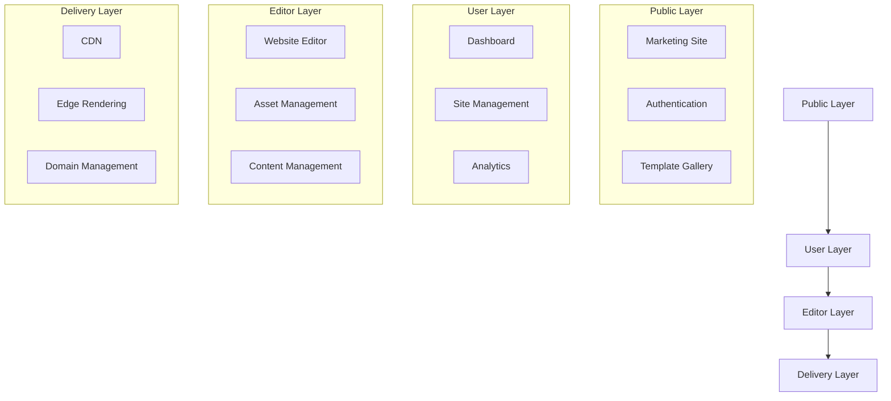
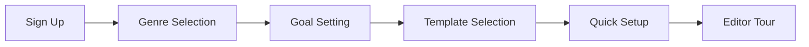

# Project Requirements Document: Author Website Builder Platform

## 1. Executive Summary

The Author Website Builder Platform is a comprehensive solution designed to help authors create and manage their professional online presence. The platform offers a user-friendly interface for building customizable websites with features specifically tailored for authors.

## 2. Project Goals

### Primary Objectives
- Enable authors to create professional websites without technical knowledge
- Provide author-specific features (book showcases, blog integration, newsletter signup)
- Ensure excellent performance and SEO optimization
- Support custom domains and professional branding

### Success Metrics
- User adoption rate
- Website creation completion rate
- Time spent in editor
- User retention rate
- Platform performance metrics

## 3. System Architecture

### Platform Layers


### Technical Stack
- Frontend: React 18 + Next.js 14
- Backend: Supabase
- Infrastructure: Vercel
- State Management: Zustand
- API Layer: tRPC
- Styling: TailwindCSS

## 4. Core Features

### 4.1 Public Layer
- Marketing site with feature showcase
- User authentication (Email, Google, Facebook)
- Template gallery with live previews
- Pricing and plan comparison
- User showcase/portfolio gallery

### 4.2 Author Dashboard
- Site management and creation
- Analytics and performance tracking
- Account and billing management
- Template customization
- Domain management

### 4.3 Website Editor
- Drag-and-drop interface
- Rich text editing
- Asset management
- Real-time preview
- Mobile responsiveness
- SEO optimization tools

### 4.4 Content Management
- Book showcase features
- Blog integration
- Newsletter signup
- Social media integration
- Event calendar

## 5. Technical Requirements

### 5.1 Performance
- Page load time < 3 seconds
- Time to Interactive < 4 seconds
- First Contentful Paint < 1.5 seconds
- Core Web Vitals compliance

### 5.2 Scalability
- Support for 100k+ concurrent users
- CDN integration for global delivery
- Automatic scaling capabilities
- Database sharding support

### 5.3 Security
- HTTPS enforcement
- JWT authentication
- CSRF protection
- Rate limiting
- DDoS protection
- Regular security audits

### 5.4 Reliability
- 99.9% uptime SLA
- Automated backups
- Disaster recovery plan
- Error monitoring and logging

## 6. User Experience Requirements

### 6.1 Onboarding Flow


### 6.2 Editor Interface
- Intuitive drag-and-drop functionality
- Real-time preview capabilities
- Undo/redo functionality
- Autosave feature
- Responsive design preview

### 6.3 Mobile Experience
- Full mobile responsiveness
- Touch-friendly interface
- Mobile preview mode
- Optimized mobile performance

## 7. Data Models

### 7.1 Core Structures
```typescript
interface AuthorSite {
  id: string;
  subdomain: string;
  template: Template;
  branding: {
    colors: ColorScheme;
    fonts: Typography;
    logo: Asset;
  };
  content: {
    books: Book[];
    series: Series[];
    posts: BlogPost[];
    pages: Page[];
  };
  settings: {
    seo: SEOSettings;
    social: SocialLinks;
    analytics: AnalyticsConfig;
  };
}
```

## 8. Implementation Phases

### Phase 1: Foundation (Weeks 1-4)
- Project setup and configuration
- Core component development
- Authentication system
- Basic editor functionality

### Phase 2: Core Features (Weeks 5-8)
- Template system
- Content management
- Asset handling
- Site publication

### Phase 3: Advanced Features (Weeks 9-12)
- Analytics integration
- SEO tools
- Performance optimization
- Custom domain support

### Phase 4: Polish & Launch (Weeks 13-16)
- Testing and QA
- Performance optimization
- Documentation
- Beta testing
- Launch preparation

## 9. Testing Requirements

### 9.1 Testing Levels
- Unit testing (80% coverage)
- Integration testing
- End-to-end testing
- Performance testing
- Security testing

### 9.2 Testing Tools
- Jest for unit testing
- Cypress for E2E testing
- Lighthouse for performance
- Security scanning tools

## 10. Monitoring and Analytics

### 10.1 System Monitoring
- Server health metrics
- Error tracking
- Performance monitoring
- User behavior analytics

### 10.2 Business Metrics
- User acquisition
- Feature usage
- Conversion rates
- Revenue metrics

## 11. Documentation Requirements

### 11.1 Technical Documentation
- API documentation
- System architecture
- Development guides
- Deployment procedures

### 11.2 User Documentation
- User guides
- Tutorial videos
- FAQ section
- Knowledge base

## 12. Post-Launch Support

### 12.1 Maintenance
- Regular updates
- Security patches
- Performance optimization
- Bug fixes

### 12.2 Support System
- Technical support
- User assistance
- Feature requests
- Bug reporting

## 13. Future Considerations

### 13.1 Planned Features
- Collaboration tools
- Advanced analytics
- AI-powered assistance
- Enhanced customization options

### 13.2 Scalability Planning
- International expansion
- Additional integrations
- Advanced feature sets
- Premium offerings