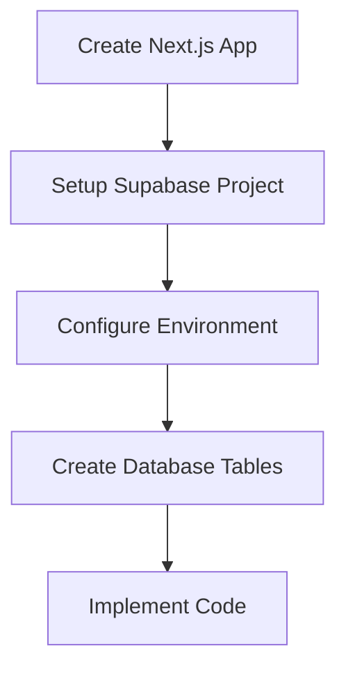

# Subdomain POC Implementation Guide

This guide outlines the step-by-step process for creating a proof-of-concept for subdomain handling using Next.js, Supabase (cloud), and Vercel's free tier.

## Project Overview



## Implementation Steps

### 1. Supabase Project Setup

1. Create Project in [Supabase Dashboard](https://app.supabase.com):
   - Click "New Project"
   - Project Name: `author-websites-poc`
   - Set Database Password
   - Choose Region
   - Wait for creation (~2 minutes)

2. Create Database Table:
```sql
-- Create sites table
create table sites (
  id uuid default gen_random_uuid() primary key,
  subdomain text unique not null check (subdomain ~* '^[a-z0-9-]+$'),
  name text not null,
  content jsonb not null default '{}'::jsonb,
  created_at timestamp with time zone default timezone('utc'::text, now()) not null
);

-- Add sample data
insert into sites (subdomain, name, content) values
  ('john', 'John Smith', 
   jsonb_build_object(
     'title', 'John Smith - Mystery Author',
     'bio', 'Bestselling author of the Detective Series',
     'books', jsonb_build_array(
       jsonb_build_object('title', 'The Missing Key', 'year', 2024),
       jsonb_build_object('title', 'Dark Alleys', 'year', 2023)
     )
   )),
  ('sarah', 'Sarah Johnson', 
   jsonb_build_object(
     'title', 'Sarah Johnson - Fantasy Author',
     'bio', 'Creator of the Magical Realms series',
     'books', jsonb_build_array(
       jsonb_build_object('title', 'Dragon''s Call', 'year', 2024),
       jsonb_build_object('title', 'Mystic Gates', 'year', 2023)
     )
   ));
```

### 2. Next.js Project Setup

1. Create project:
```bash
npx create-next-app@latest subdomain-poc --typescript --tailwind --app
cd subdomain-poc
npm install @supabase/supabase-js
```

2. Get Supabase credentials from Project Settings > API:
   - Project URL
   - anon/public key

3. Create `.env.local`:
```plaintext
NEXT_PUBLIC_SUPABASE_URL=your-project-url
NEXT_PUBLIC_SUPABASE_ANON_KEY=your-anon-key
```

### 3. Implementation Files

#### Types Definition
```typescript
// lib/types.ts
export interface Site {
  id: string;
  subdomain: string;
  name: string;
  content: {
    title: string;
    bio: string;
    books: Array<{
      title: string;
      year: number;
    }>;
  };
  created_at: string;
}

export type Database = {
  public: {
    Tables: {
      sites: {
        Row: Site;
      };
    };
  };
};
```

#### Supabase Client
```typescript
// lib/supabase.ts
import { createClient } from '@supabase/supabase-js'
import { Database } from './types'

if (!process.env.NEXT_PUBLIC_SUPABASE_URL) {
  throw new Error('Missing env.NEXT_PUBLIC_SUPABASE_URL')
}
if (!process.env.NEXT_PUBLIC_SUPABASE_ANON_KEY) {
  throw new Error('Missing env.NEXT_PUBLIC_SUPABASE_ANON_KEY')
}

export const supabase = createClient<Database>(
  process.env.NEXT_PUBLIC_SUPABASE_URL,
  process.env.NEXT_PUBLIC_SUPABASE_ANON_KEY
)
```

#### Middleware
```typescript
// middleware.ts
import { NextResponse } from 'next/server'
import type { NextRequest } from 'next/server'
import { supabase } from './lib/supabase'

export async function middleware(request: NextRequest) {
  const hostname = request.headers.get('host')

  // For local development
  const subdomain = hostname?.split('.')[0]
  
  if (!subdomain) {
    return NextResponse.redirect(new URL('/404', request.url))
  }

  const { data: site } = await supabase
    .from('sites')
    .select('*')
    .eq('subdomain', subdomain)
    .single()

  if (!site) {
    return NextResponse.redirect(new URL('/404', request.url))
  }

  // Add site data to headers
  const requestHeaders = new Headers(request.headers)
  requestHeaders.set('x-site-data', JSON.stringify(site))

  return NextResponse.next({
    request: {
      headers: requestHeaders,
    },
  })
}

export const config = {
  matcher: [
    '/((?!api|_next/static|_next/image|favicon.ico).*)',
  ],
}
```

#### Dynamic Page
```typescript
// app/[...path]/page.tsx
import { headers } from 'next/headers'
import SiteRenderer from '@/components/SiteRenderer'

export default async function SitePage() {
  const headersList = headers()
  const siteData = headersList.get('x-site-data')
  
  if (!siteData) {
    return <div>Site not found</div>
  }
  
  const site = JSON.parse(siteData)
  
  return <SiteRenderer site={site} />
}
```

#### Site Renderer Component
```typescript
// components/SiteRenderer.tsx
'use client'

import { Site } from '@/lib/types'

export default function SiteRenderer({ site }: { site: Site }) {
  return (
    <div className="min-h-screen bg-white">
      <main className="max-w-4xl mx-auto py-16 px-4">
        <h1 className="text-4xl font-bold text-gray-900">
          {site.content.title}
        </h1>
        <div className="mt-8 prose lg:prose-xl">
          <p>{site.content.bio}</p>
          <h2>Books</h2>
          <ul>
            {site.content.books.map((book) => (
              <li key={book.title}>
                {book.title} ({book.year})
              </li>
            ))}
          </ul>
        </div>
      </main>
    </div>
  )
}
```

### 4. Local Development Setup

1. Configure local domains:
```bash
# Add to /etc/hosts
127.0.0.1 john.localhost
127.0.0.1 sarah.localhost
```

2. Start development server:
```bash
npm run dev
```

3. Test local URLs:
- http://john.localhost:3000
- http://sarah.localhost:3000

### 5. Deployment Process

1. Version Control:
   - Initialize Git repository
   - Create `.gitignore` (ensure .env.local is included)
   - Push to GitHub

2. Vercel Setup:
   - Create new project
   - Import GitHub repository
   - Add environment variables:
     ```
     NEXT_PUBLIC_SUPABASE_URL=your-project-url
     NEXT_PUBLIC_SUPABASE_ANON_KEY=your-anon-key
     ```
   - Deploy

3. Domain Configuration:
   - Add `*.authorwebsites.io` in Vercel
   - Configure DNS settings as per Vercel instructions
   - Wait for SSL certificate provisioning

## Testing Checklist

1. Local Development:
- [ ] Subdomain routing works locally
- [ ] Sample sites load correctly
- [ ] Content displays properly

2. Production:
- [ ] Vercel deployment successful
- [ ] Environment variables configured
- [ ] SSL certificates active
- [ ] Subdomains resolving correctly
- [ ] Content loading from Supabase

## Next Steps

After successful implementation:
1. Monitor performance
2. Test edge cases
3. Add error boundaries
4. Implement caching
5. Add analytics tracking

This proof-of-concept demonstrates:
- Subdomain routing
- Database integration
- Dynamic content loading
- Production deployment
- Edge function compatibility