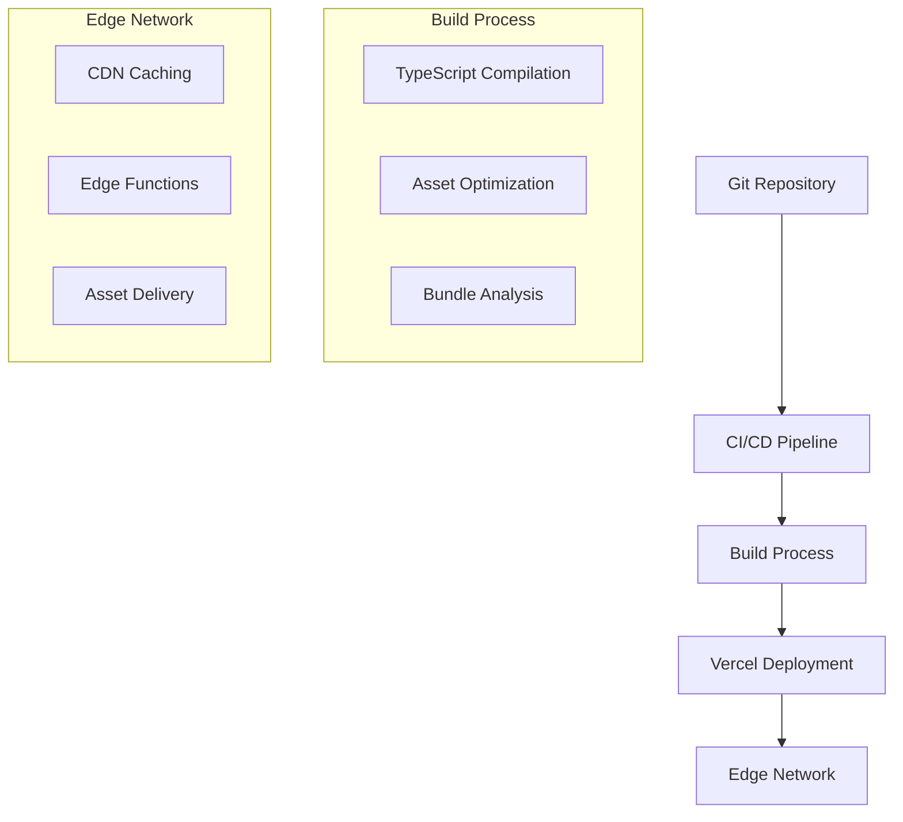

# Technical Stack Documentation

## 1. Frontend Architecture

### 1.1 Core Technologies
```typescript
const frontendStack = {
  framework: {
    name: 'Next.js',
    version: '14.x',
    features: [
      'App Router',
      'Server Components',
      'Edge Runtime',
      'Image Optimization'
    ]
  },
  language: {
    name: 'TypeScript',
    version: '5.x',
    config: {
      strict: true,
      target: 'ES2022'
    }
  },
  styling: {
    framework: 'TailwindCSS',
    plugins: [
      '@tailwindcss/typography',
      '@tailwindcss/forms'
    ]
  }
};
```

### 1.2 State Management
```typescript
interface StateArchitecture {
  global: {
    manager: 'Zustand';
    stores: {
      auth: AuthStore;
      editor: EditorStore;
      site: SiteStore;
      ui: UIStore;
    };
  };
  local: {
    manager: 'React Query';
    features: [
      'Data Fetching',
      'Cache Management',
      'Optimistic Updates'
    ];
  };
}
```

### 1.3 Editor Components
```typescript
const editorComponents = {
  richText: {
    library: 'TipTap',
    extensions: [
      'Typography',
      'Placeholder',
      'Image',
      'Link',
      'CodeBlock'
    ]
  },
  dragAndDrop: '@dnd-kit/core',
  mediaHandling: {
    upload: 'next-upload',
    optimization: 'sharp'
  }
};
```

## 2. Backend Architecture

### 2.1 Core Infrastructure
```typescript
const backendStack = {
  database: {
    primary: {
      type: 'PostgreSQL',
      provider: 'Supabase',
      features: [
        'Row Level Security',
        'Real-time Subscriptions',
        'Full-text Search'
      ]
    },
    cache: {
      type: 'Redis',
      usage: [
        'Session Storage',
        'Rate Limiting',
        'Real-time Pub/Sub'
      ]
    }
  },
  authentication: {
    provider: 'Supabase Auth',
    methods: [
      'Email/Password',
      'Google OAuth',
      'Facebook OAuth'
    ],
    features: [
      'JWT Tokens',
      '2FA Support',
      'Session Management'
    ]
  }
};
```

### 2.2 API Layer
```typescript
const apiArchitecture = {
  framework: 'tRPC',
  features: [
    'End-to-end Type Safety',
    'Automatic API Documentation',
    'Request Batching',
    'Subscription Support'
  ],
  middleware: [
    'Authentication',
    'Rate Limiting',
    'Error Handling',
    'Request Logging'
  ]
};
```

## 3. Infrastructure

### 3.1 Deployment


### 3.2 Infrastructure Configuration
```typescript
const infrastructureStack = {
  deployment: {
    platform: 'Vercel',
    features: [
      'Automatic HTTPS',
      'Edge Functions',
      'Preview Deployments',
      'Analytics'
    ]
  },
  cdn: {
    provider: 'Vercel Edge Network',
    features: [
      'Global Distribution',
      'Automatic Caching',
      'Image Optimization',
      'Edge Computing'
    ]
  },
  monitoring: {
    error: 'Sentry',
    performance: 'Vercel Analytics',
    logging: 'LogDNA'
  }
};
```

## 4. Development Environment

### 4.1 Tools and Configuration
```typescript
const devEnvironment = {
  editor: {
    name: 'VS Code',
    extensions: [
      'ESLint',
      'Prettier',
      'TypeScript',
      'Tailwind CSS IntelliSense'
    ]
  },
  linting: {
    tools: [
      'ESLint',
      'Prettier',
      'TypeScript'
    ],
    config: {
      extends: [
        'next/core-web-vitals',
        'prettier'
      ]
    }
  },
  testing: {
    unit: 'Jest',
    integration: 'Testing Library',
    e2e: 'Cypress',
    performance: 'Lighthouse'
  }
};
```

## 5. Performance Optimization

### 5.1 Frontend Optimization
```typescript
const performanceOptimizations = {
  images: {
    formats: ['WebP', 'AVIF'],
    loading: 'Lazy',
    optimization: 'Automatic'
  },
  javascript: {
    bundling: 'Automatic Code Splitting',
    loading: 'Dynamic Imports',
    execution: 'Edge Runtime'
  },
  css: {
    purging: 'Tailwind JIT',
    minification: true,
    critical: 'Automatic Extraction'
  }
};
```

### 5.2 Caching Strategy
```typescript
const cachingStrategy = {
  static: {
    duration: '1 year',
    invalidation: 'Build-time'
  },
  dynamic: {
    duration: '1 hour',
    revalidation: 'Background'
  },
  api: {
    duration: '1 minute',
    staleWhileRevalidate: true
  }
};
```

## 6. Security Implementation

### 6.1 Security Measures
```typescript
const securityStack = {
  authentication: {
    jwt: {
      algorithm: 'RS256',
      expiry: '1h'
    },
    session: {
      type: 'Stateless',
      storage: 'HttpOnly Cookie'
    }
  },
  protection: {
    csrf: true,
    xss: {
      headers: true,
      sanitization: true
    },
    rateLimit: {
      window: '1m',
      max: 100
    }
  },
  monitoring: {
    logging: true,
    alerting: true,
    audit: true
  }
};
```

## 7. Database Schema

### 7.1 Core Tables
```sql
-- Sites
CREATE TABLE sites (
  id UUID PRIMARY KEY,
  user_id UUID REFERENCES auth.users,
  domain TEXT UNIQUE,
  settings JSONB,
  created_at TIMESTAMPTZ DEFAULT NOW(),
  updated_at TIMESTAMPTZ DEFAULT NOW()
);

-- Pages
CREATE TABLE pages (
  id UUID PRIMARY KEY,
  site_id UUID REFERENCES sites,
  slug TEXT,
  content JSONB,
  meta JSONB,
  published BOOLEAN DEFAULT false,
  UNIQUE(site_id, slug)
);

-- Assets
CREATE TABLE assets (
  id UUID PRIMARY KEY,
  site_id UUID REFERENCES sites,
  type TEXT,
  url TEXT,
  meta JSONB,
  created_at TIMESTAMPTZ DEFAULT NOW()
);
```

## 8. Testing Strategy

### 8.1 Testing Implementation
```typescript
const testingStrategy = {
  unit: {
    framework: 'Jest',
    coverage: {
      statements: 80,
      branches: 80,
      functions: 80,
      lines: 80
    }
  },
  integration: {
    framework: 'Testing Library',
    scope: [
      'Component Integration',
      'API Integration',
      'State Management'
    ]
  },
  e2e: {
    framework: 'Cypress',
    coverage: [
      'Critical User Paths',
      'Authentication Flows',
      'Editor Functions'
    ]
  }
};
```

## 9. Monitoring and Analytics

### 9.1 Monitoring Stack
```typescript
const monitoringStack = {
  error: {
    tool: 'Sentry',
    features: [
      'Real-time Error Tracking',
      'Performance Monitoring',
      'Session Replay'
    ]
  },
  performance: {
    tool: 'Vercel Analytics',
    metrics: [
      'Core Web Vitals',
      'Page Load Times',
      'API Response Times'
    ]
  },
  logging: {
    tool: 'LogDNA',
    levels: [
      'Error',
      'Warning',
      'Info',
      'Debug'
    ]
  }
};
```

## 10. Integration Points

### 10.1 Third-party Services
```typescript
const integrations = {
  email: {
    provider: 'SendGrid',
    features: [
      'Transactional Emails',
      'Marketing Campaigns',
      'Email Templates'
    ]
  },
  payment: {
    provider: 'Stripe',
    features: [
      'Subscription Management',
      'Usage-based Billing',
      'Invoice Generation'
    ]
  },
  analytics: {
    provider: 'Google Analytics',
    features: [
      'Page Analytics',
      'Event Tracking',
      'User Flow Analysis'
    ]
  }
};